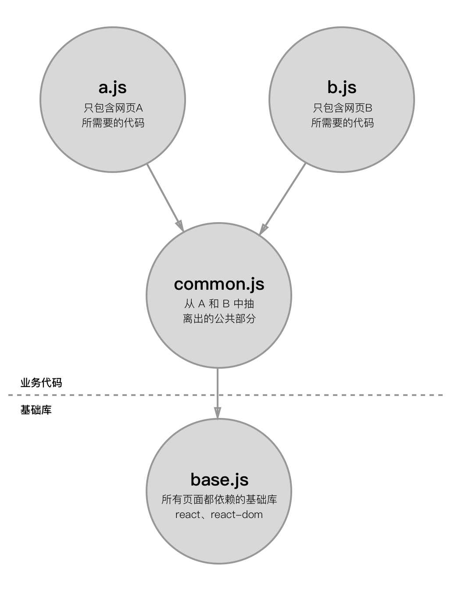

### 提取公共代码

#### 为什么需要提取公共代码
大型网站通常会由多个页面组成，每个页面都是一个独立的单页应用。
但由于所有页面都采用同样的技术栈，以及使用同一套样式代码，这导致这些页面之间有很多相同的代码。

如果每个页面的代码都把这些公共的部分包含进去，会造成以下问题：

- 相同的资源被重复的加载，浪费用户的流量和服务器的成本；
- 每个页面需要加载的资源太大，导致网页首屏加载缓慢，影响用户体验。

如果把多个页面公共的代码抽离成单独的文件，就能优化以上问题。
原因是假如用户访问了网站的其中一个网页，那么访问这个网站下的其它网页的概率将非常大。
在用户第一次访问后，这些页面公共代码的文件已经被浏览器缓存起来，在用户切换到其它页面时，存放公共代码的文件就不会再重新加载，而是直接从缓存中获取。
这样做后有如下好处：

- 减少网络传输流量，降低服务器成本；
- 虽然用户第一次打开网站的速度得不到优化，但之后访问其它页面的速度将大大提升。

#### 如何提取公共代码
你已经知道了提取公共代码会有什么好处，但是在实战中具体要怎么做，以达到效果最优呢？
通常你可以采用以下原则去为你的网站提取公共代码：

- 根据你网站所使用的技术栈，找出网站所有页面都需要用到的基础库，以采用 React 技术栈的网站为例，所有页面都会依赖 react、react-dom 等库，把它们提取到一个单独的文件。
一般把这个文件叫做 `base.js`，因为它包含所有网页的基础运行环境；
- 在剔除了各个页面中被 `base.js` 包含的部分代码外，再找出所有页面都依赖的公共部分的代码提取出来放到 `common.js` 中去。
- 再为每个网页都生成一个单独的文件，这个文件中不再包含 `base.js` 和 `common.js` 中包含的部分，而只包含各个页面单独需要的部分代码。

文件之间的结构图如下：



读到这里你可以会有疑问：既然能找出所有页面都依赖的公共代码，并提取出来放到 `common.js` 中去，为什么还需要再把网站所有页面都需要用到的基础库提取到 `base.js` 去呢？
原因是为了长期的缓存 `base.js` 这个文件。

发布到线上的文件都会采用在[4-9CDN加速](4-9CDN加速.md)中介绍过的方法，对静态文件的文件名都附加根据文件内容计算出 Hash 值，也就是最终 `base.js` 的文件名会变成 `base_3b1682ac.js`，以长期缓存文件。
网站通常会不断的更新发布，每次发布都会导致 `common.js` 和各个网页的 JavaScript 文件都会因为文件内容发生变化而导致其 Hash 值被更新，也就是缓存被更新。

把所有页面都需要用到的基础库提取到 `base.js` 的好处在于只要不升级基础库的版本，`base.js` 的文件内容就不会变化，Hash 值不会被更新，缓存就不会被更新。
每次发布浏览器都会使用被缓存的 `base.js` 文件，而不用去重新下载 `base.js` 文件。 
由于 `base.js` 通常会很大，这对提升网页加速速度能起到很大的效果。

#### 如何通过 Webpack 提取公共代码
你已经知道如何提取公共代码，接下来教你如何用 Webpack 实现。

Webpack 内置了专门用于提取多个 Chunk 中公共部分的插件 CommonsChunkPlugin，CommonsChunkPlugin 大致使用方法如下：
```js
const CommonsChunkPlugin = require('webpack/lib/optimize/CommonsChunkPlugin');

new CommonsChunkPlugin({
  // 从哪些 Chunk 中提取
  chunks: ['a', 'b'],
  // 提取出的公共部分形成一个新的 Chunk，这个新 Chunk 的名称
  name: 'common'
})
```
以上配置就能从网页 A 和网页 B 中抽离出公共部分，放到 common 中。

每个 CommonsChunkPlugin 实例都会生成一个新的 Chunk，这个新 Chunk 中包含了被提取出的代码，在使用过程中必须指定 `name` 属性，以告诉插件新生成的 Chunk 的名称。
其中 `chunks` 属性指明从哪些已有的 Chunk 中提取，如果不填该属性，则默认会从所有已知的 Chunk 中提取。

> Chunk 是一系列文件的集合，一个 Chunk 中会包含这个 Chunk 的入口文件和入口文件依赖的文件。

通过以上配置输出的 common Chunk 中会包含所有页面都依赖的基础运行库 react、react-dom，为了把基础运行库从 common 中抽离到 base 中去，还需要做一些处理。

首先需要先配置一个 Chunk，这个 Chunk 中只依赖所有页面都依赖的基础库以及所有页面都使用的样式，为此需要在项目中写一个文件 `base.js` 来描述 base Chunk 所依赖的模块，文件内容如下：
```js
// 所有页面都依赖的基础库
import 'react';
import 'react-dom';
// 所有页面都使用的样式
import './base.css';
```
接着再修改 Webpack 配置，在 entry 中加入 base，相关修改如下：
```js
module.exports = {
  entry: {
    base: './base.js'
  },
};
```
以上就完成了对新 Chunk base 的配置。

为了从 common 中提取出 base 也包含的部分，还需要配置一个 CommonsChunkPlugin，相关代码如下：
```js
new CommonsChunkPlugin({
  // 从 common 和 base 两个现成的 Chunk 中提取公共的部分
  chunks: ['common', 'base'],
  // 把公共的部分放到 base 中
  name: 'base'
})
```
由于 common 和 base 公共的部分就是 base 目前已经包含的部分，所以这样配置后 common 将会变小，而 base 将保持不变。

以上都配置好后重新执行构建，你将会得到四个文件，它们分别是：

- `base.js`：所有网页都依赖的基础库组成的代码；
- `common.js`：除了 `base.js` 中包含的部分外，网页 A、B 都需要的代码；
- `a.js`：网页 A 单独需要的代码；
- `b.js`：网页 B 单独需要的代码。

为了让网页正常运行，以网页 A 为例，你需要在其 HTML 中按照以下顺序引入以下文件才能让网页正常运行：
```html
<script src="base.js"></script>
<script src="common.js"></script>
<script src="a.js"></script>
```

以上就完成了提取公共代码需要的所有步骤。

针对 CSS 资源，以上理论和方法同样有效，也就是说你也可以对 CSS 文件做同样的优化。

以上方法可能会出现 `common.js` 中没有代码的情况，原因是除去基础运行库外很难再找到所有页面都会用上的模块。
在出现这种情况时，你可以采取以下做法之一：

- CommonsChunkPlugin 提供一个选项 `minChunks`，表示文件要被提取出来时需要在指定的 Chunks 中最小出现最小次数。
假如 `minChunks=2`、`chunks=['a','b','c','d']`，任何一个文件只要在 `['a','b','c','d']` 中任意两个以上的 Chunk 中都出现过，这个文件就会被提取出来。
你可以根据自己的需求去调整 minChunks 的值，minChunks 越小越多的文件会被提取到 `common.js` 中去，但这也会导致部分页面加载的不相关的资源越多；
minChunks 越大越少的文件会被提取到 `common.js` 中去，但这会导致 `common.js` 变小、效果变弱。
- 根据各个页面之间的相关性选取其中的部分页面用 CommonsChunkPlugin 去提取这部分被选出的页面的公共部分，而不是提取所有页面的公共部分，而且这样的操作可以叠加多次。
这样做的效果会很好，但缺点是配置复杂，你需要根据页面之间的关系去思考如何配置，该方法不通用。

> 本实例[提供项目完整代码](http://webpack.wuhaolin.cn/4-11提取公共代码.zip)
